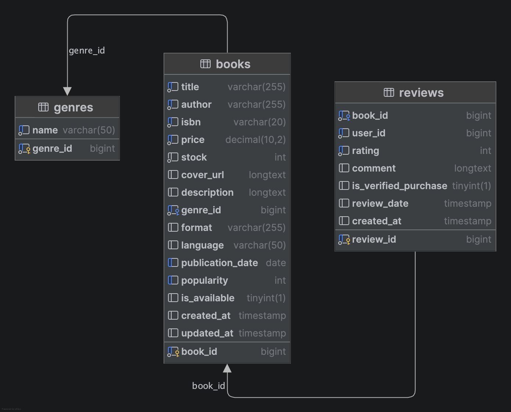
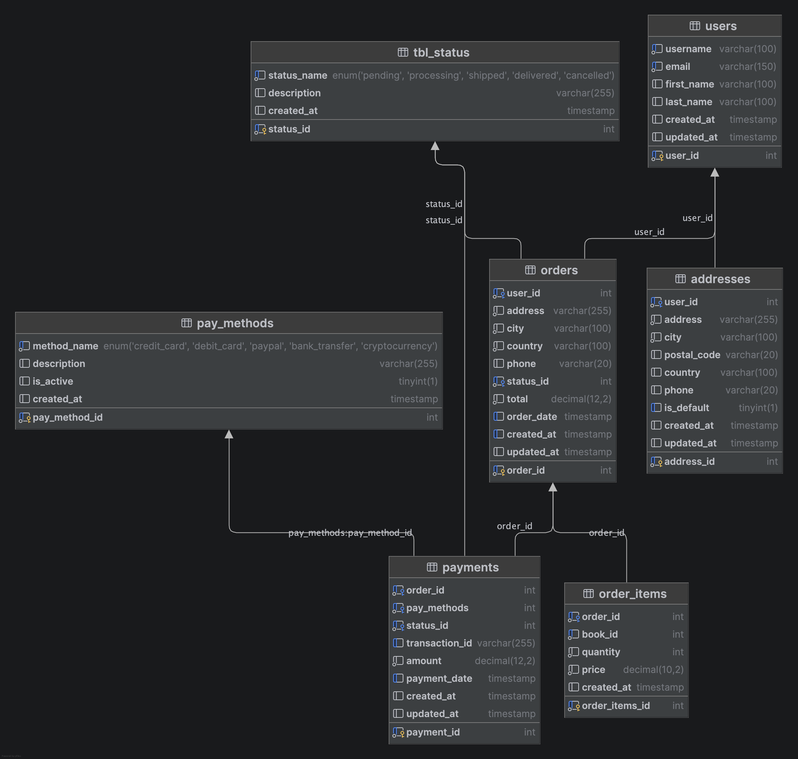

## 🏆 Entregales actividad 2: Laboratorio. Desarrollo back-end: microservicios con Java y Spring

### Enlaces de la entrega  🔗 

#### [Vídeo-memoria]()

#### [URL del proyecto despleago]()

# 📚 Relatos de Papel - E-Commerce de Libros

Plataforma e-commerce moderna para la venta de libros físicos y digitales, desarrollada con **Java** y **SpringBoot**, como proyecto del Máster Universitario en Ingeniería de Software y Sistemas Informáticos de UNIR.

## 🚀 Stack Tecnológico

### Backend

- **Java 26**
- **SpringBoot**

### Herramientas de Desarrollo

- 

## 📁 Estructura del Proyecto

Code

## 🎯 Funcionalidades Principales

### 1. **Catálogo de Libros**

- 

### 2. **Detalle de Libro**

- 

### 3. **Carrito de Compras**

- 

### 4. **Autenticación**

- 

## 🔄Flujo de comunicación entre microservicios (Catalogue - Orders)
```text
┌─────────────────────────────────────────────────────────────┐
│                          FRONTEND                           │
└───────────────────────┬─────────────────────────────────────┘
                        │
            ┌───────────┼───────────┐
            │           │           │
            ▼           ▼           ▼
       ┌─────────┐ ┌──────────┐ ┌────────┐
       │Catálogo │ │ Detalle  │ │Carrito │
       │(GET)    │ │(GET)     │ │(POST)  │
       └────┬────┘ └────┬─────┘ └───┬────┘
            │           │           │
            └───────────┼───────────┘
                        │
                        ▼
            ┌────────────────────────────┐
            │    MICROSERVICIO 1         │
            │       CATALOGUE            │
            │         :8081              │
            │   ✓ GET /books             │
            │   ✓ GET /books/:title      │
            │   ✓ GET /books/:author     │
            │   ✓ GET /books/:popularity │
            │   ✓ POST /books            │
            │   ✓ PATCH /books/:id       │
            │   ✓ DELETE /books/:id      │
            └───────────┬────────────────┘
                        │
                DB: books_catalogue
            └───────────────────────┘
                        │
                        │ Validación
                        │ (stock, visible)
                        ▼
            ┌───────────────────────┐
            │    MICROSERVICIO 2    │
            │        ORDERS         │
            │         :8082         │
            │   ✓ POST /orders      │
            │   ✓ GET /orders/:id   │
            └───────────┬───────────┘
                        │
                 DB: books_orders
            └───────────────────────┘
```

## Modelo entidad-relación

### Microservicio Catalogue


### Microservicio Orders


## 🛠️ Instalación y Configuración

### Requisitos
* Java 26
* docker

### Pasos

## Clonar repositorio

```bash
git clone git@github.com:jmogollon-unir/dev_full_stack.git

cd dev_full_stack
```

## Crear bases de datos local con docker

```bash
docker pull mysql
```

### Microservicio Catalogue
```bash
docker run -p 3307:3306 --name books_catalogue -e MYSQL_ROOT_PASSWORD=mysql -d mysql:latest
```

### Microservicio Orders
```bash
docker run -p 3308:3306 --name books_orders -e MYSQL_ROOT_PASSWORD=mysql -d mysql:latest
```

### Configurar base desde dataGrip

#### Microservicio Catalogue

- Con ayuda del file **catalogue/books_catalogue.sql** se pueden crear las tablas de la base de datos y completar con datos de mocks

#### Microservicio Orders

- Con ayuda del file **orders/books_orders.sql** se pueden crear las tablas de la base de datos y completar con datos de mocks

## Iniciar servidor de desarrollo desde intelliJ IDEA

- 

👥 Integrantes
Proyecto desarrollado por el Grupo 18 de la materia Desarrollo Full Stack del Máster Universitario en Ingeniería de Software y Sistemas Informáticos - UNIR.

* Julieth Camila Mogollón Bernal 
* Leonardo Cashiel Olaechea Saavedra 
* José Miguel Jamette Garrido 
* Francisco Javier Febles Jimenez
* Elsy Paola Amaya Lazo

