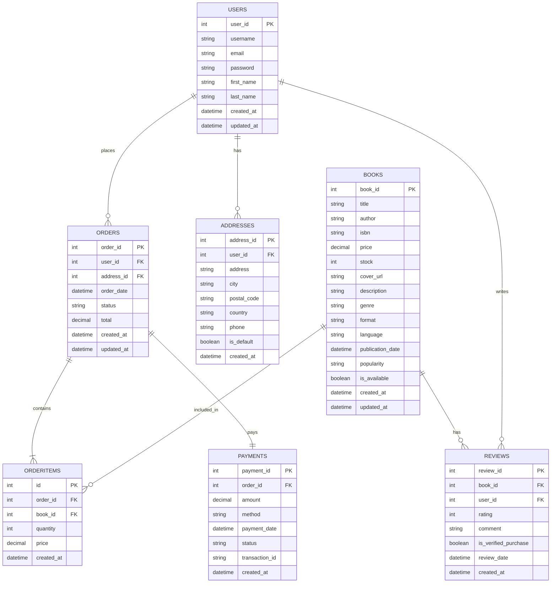

## 🏆 Entregales actividad 2: Laboratorio. Desarrollo back-end: microservicios con Java y Spring

### Enlaces de la entrega  🔗 

#### [Vídeo-memoria]()

#### [URL del proyecto despleago]()

# 📚 Relatos de Papel - E-Commerce de Libros

Plataforma e-commerce moderna para la venta de libros físicos y digitales, desarrollada con **Java** y **SpringBoot**, como proyecto del Máster Universitario en Ingeniería de Software y Sistemas Informáticos de UNIR.

## 🚀 Stack Tecnológico

### Backend

- **Java 26**
- **SpringBoot**

### Herramientas de Desarrollo

- 

## 📁 Estructura del Proyecto


Code

## 🎯 Funcionalidades Principales

### 1. **Catálogo de Libros**

- 

### 2. **Detalle de Libro**

- 

### 3. **Carrito de Compras**

- 

### 4. **Autenticación**

- 

## Modelo entidad-relación


## 🛠️ Instalación y Configuración

### Requisitos
* Java 26
* docker

### Pasos

## Clonar repositorio

```bash
git clone git@github.com:jmogollon-unir/dev_full_stack.git

cd dev_full_stack
```

## Crear base de datos local con docker

```bash
docker pull mysql
```

```bash
docker run -p 3306:3306 --name db-relatosdepapel -e MYSQL_ROOT_PASSWORD=mysql -d mysql:latest
```

### Configurar base desde dataGrip

#### Crear base de datos MySQL

- Crear base de datos local con usuario *root* y password *mysql*

#### Crear schema base de datos MySQL

```bash
CREATE SCHEMA IF NOT EXISTS books_catalogue;
USE books_catalogue;
```

#### Crear tablas

- Copiar y ejecuta **books_catalogue.sql** para crear las tablas de la base de datos acorde con el diagrama entidad-relación

#### Insertar datos

- Copiar y ejecuta **data.sql** para llenar las tablas de la base de datos con datos mocks

## Iniciar servidor de desarrollo desde intelliJ IDEA

- 

👥 Integrantes
Proyecto desarrollado por el Grupo 18 de la materia Desarrollo Full Stack del Máster Universitario en Ingeniería de Software y Sistemas Informáticos - UNIR.

* Julieth Camila Mogollón Bernal 
* Leonardo Cashiel Olaechea Saavedra 
* José Miguel Jamette Garrido 
* Francisco Javier Febles Jimenez
* Elsy Paola Amaya Lazo

